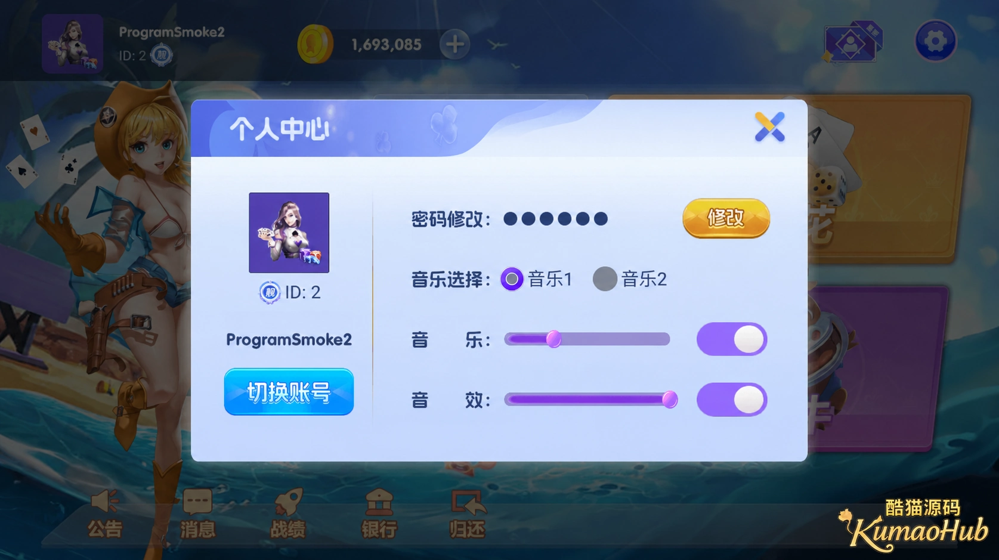
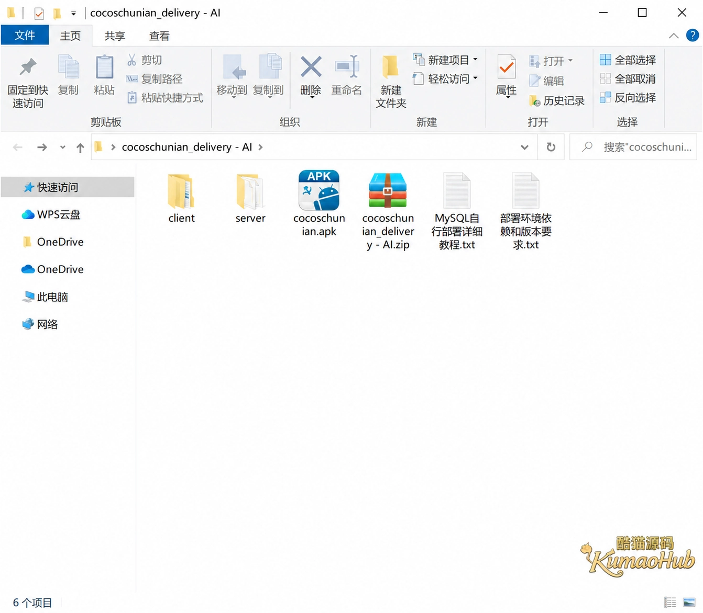

# 全新初念棋牌游戏房卡源码组件｜德州、炸金花、牛牛、龙虎斗带文字搭建教程

初念是一套安卓端棋牌游戏源码组件，包含德州扑克、炸金花、牛牛和龙虎斗四种玩法，配套 Node.js 服务端、后台管理系统及文字搭建教程。项目同时提供客户端与服务端目录、安卓 APK 和 MySQL 部署资料，便于围绕客户端开发、服务端配置和数据库环境开展技术交流。

## 客户端与服务端

初念采用安卓客户端，安装包为 `cocoschunian.apk`，本套资料不含苹果端。服务端使用 Node.js，并配有后台管理系统。

项目将客户端和服务端分别放在 `client`、`server` 目录中。客户端工程、服务端工程和 APK 安装包各自独立：工程目录用于开发维护，APK 用于安卓设备安装。配套文档则单独说明运行环境与数据库部署。

| 项目组成 | 对应内容 |
| --- | --- |
| 安卓客户端 | `client` 目录、`cocoschunian.apk` 安装包 |
| Node.js 服务端 | `server` 目录 |
| 后台管理 | 配套后台管理系统 |
| 数据库教程 | `MySQL自行部署详细教程.txt` |
| 环境说明 | `部署环境依赖和版本要求.txt` |

## 登录与大厅

客户端以沙滩主题作为启动画面，登录页提供微信登录、账号登录、身份卡登录和游客登录四种入口。登录与游戏大厅分为独立页面，大厅统一承载子游戏入口和公共功能。


大厅将德州扑克、炸金花、龙虎斗、牛牛分为四个入口。公告、消息、战绩、银行和设置等功能集中在公共大厅中，玩家无需进入具体子游戏即可访问相应入口。


## 四种玩法

初念的子游戏围绕扑克玩法展开，包含德州扑克、炸金花、牛牛和龙虎斗。四种玩法各有独立入口，共用同一套大厅界面。

从棋牌游戏开发的角度，牌型判断与对局流程是两个不同层面的逻辑：牌型判断处理手牌结果，对局流程处理当前轮次、操作顺序和结束条件。将两者分开讨论，有助于明确规则差异，也便于为不同玩法编写独立的规则测试。

三张牌、五张牌以及包含公共牌的玩法，不能共用一套未经区分的判定条件。相同牌型的大小比较、特殊牌型和同点数处理，都应以各玩法的具体规则为准。

## 账号与声音设置

个人中心集中提供密码修改、账号切换和声音设置。音乐设有两组选项，背景音乐与游戏音效分别配有音量调节和开关。

音乐与音效分别设置，方便玩家保留操作提示音，同时单独调整背景音乐。账号切换和密码修改则归在账号功能中，与声音设置共用个人中心入口。



## 金币与保险箱

银行模块提供金币和保险箱两组数值，包含存入、取出、数量输入与快捷数量选择。数量既可手动输入，也可通过预设选项选择。

在这类数值操作中，输入校验与状态更新需要分别处理。输入校验限制无效数量，状态更新负责保持操作前后的数据一致。界面上的数值显示属于交互层，不能替代服务端对操作权限和实际余额的判断。


## 工程与搭建资料

项目资料按客户端、服务端、安装包和教程分别组织：

```text
cocoschunian_delivery - AI/
├── client/
├── server/
├── cocoschunian.apk
├── cocoschunian_delivery - AI.zip
├── MySQL自行部署详细教程.txt
└── 部署环境依赖和版本要求.txt
```

文字搭建资料包含两部分：一份是 MySQL 自行部署详细教程，另一份是部署环境依赖和版本要求。前者对应数据库部署，后者对应项目运行环境，具体步骤与版本以随附文档为准。

APK 是客户端安装文件，服务端程序和数据库环境仍属于单独的部署部分。客户端安装、服务端运行与数据库配置各有对应资料，不能将安装 APK 等同于完成整套项目部署。



## 技术交流

交流内容包括安卓客户端、Node.js 服务端、MySQL 部署，以及棋牌游戏的规则逻辑和公共功能设计。

Telegram：[@root4433](https://t.me/root4433)

仅供技术学习与交流，禁止用于赌博等违法活动。代码及素材的使用和传播应遵守相应授权。
